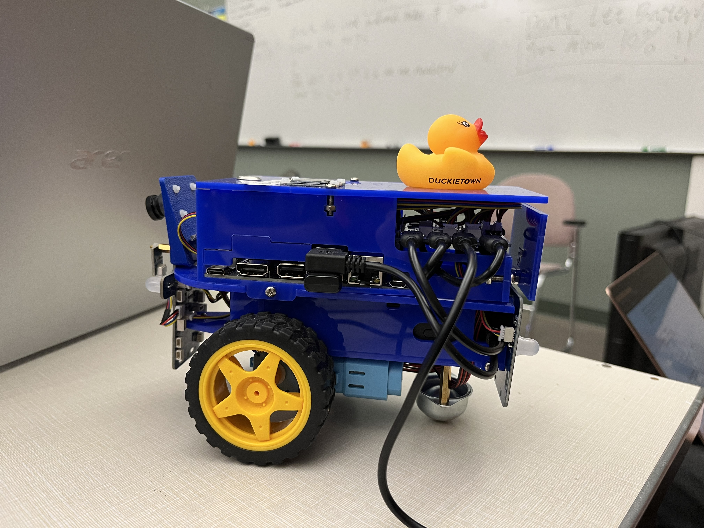
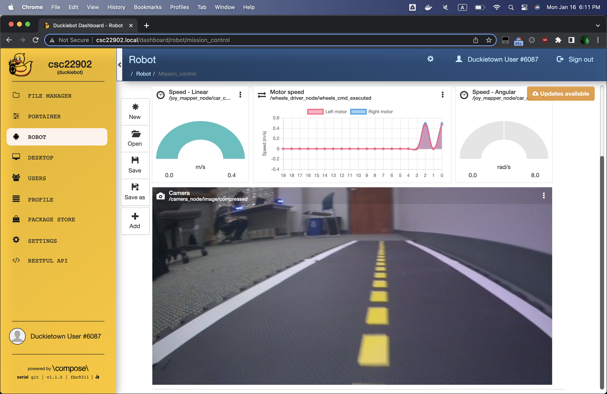
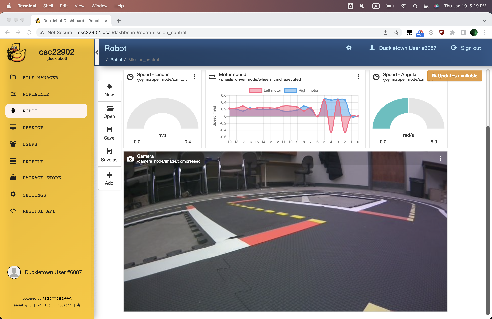

# Exercise 1

## Demos

### Straight Line Demo

<iframe width="100%" height="315" src="https://www.youtube.com/embed/XhuX9_fkPuY" title="YouTube video player" frameborder="0" allow="accelerometer; autoplay; clipboard-write; encrypted-media; gyroscope; picture-in-picture; web-share" allowfullscreen></iframe>

Even after lots of wheel trim calibration, we see that the Duckiebot still does not travel in a perfectly straight line. This is because in the real world, many of assumptions do not hold, and there are many variables that affect the drift besides trim. For example, the wheels aren't point contacts, there is friction, uneven surfaces. However, the Duckiebot drifts by less than 10 cm in a 2 m run, which the Duckumentation states is sufficient for Duckietown.

### Dashboard

### Lane Following Demo

<iframe width="100%" height="315" src="https://www.youtube.com/embed/Fs1bxWm-WQ0" title="YouTube video player" frameborder="0" allow="accelerometer; autoplay; clipboard-write; encrypted-media; gyroscope; picture-in-picture; web-share" allowfullscreen></iframe>

The lane following demo worked pretty well after re-calibration. In my first
attempt, it would constantly drive on the white lines, suggesting that
good camera and wheel calibration is important for good lane following
performance.

## Write Up

### Implemented

* A hello from Duckiebot Docker container.
* A color detector Docker container.

[Exercise 1 Code Implementation](https://github.com/steventango/cmput-412-labs/tree/main/exercise-1)

### Learned

I learned about the complexities of Duckiebot networking, including how to ssh into Duckiebot with `ssh duckie@csc22902.local`, and most importantly how to run Docker
commands on a Duckiebot `docker -H csc22902.local ...`. I also learned to be ready to debug what seemingly worked yesterday. With so many variables at play, things broke often, and I learned to quickly find work arounds.

### Challenges

#### **macOS**

A big challenge was dealing with the fact that there is no way to dual boot
Ubuntu onto a M2 Macbook. I attempted a native macOS install, a Ubuntu Docker container, but both were quite buggy.

Later, I found that a nice free option is to use create an
Ubuntu 20.04.5 VM using [UTM](https://mac.getutm.app/). It was difficult but eventually I found an Ubuntu image for the ARM architecture, available [here](https://cdimage.ubuntu.com/focal/daily-live/current/). I only ran into a few challenges with the Ubuntu VM, mostly due to using the ARM architecture image.

Firstly, I couldn't install Docker Desktop, so
I had to [manually install Docker](https://docs.docker.com/engine/install/ubuntu/#install-using-the-repository).

Some `dts` dependencies
were broken, and I had to manually update the `pip` and `requests` packages.

Overall, this VM
seems to mostly work reliably for `dts` commands,
except commands that rely on docker images that require AMD64 architecture like `dts duckiebot calibrate_intrinsics`. Considering this, it may be worth it in the future to take the performance hit and create a VM that emulate the AMD64 architecture.

I found a nice [tutorial](https://medium.com/@lizrice/linux-vms-on-an-m1-based-mac-with-vscode-and-utm-d73e7cb06133) for accessing
a Ubuntu VM through VS Code on the host machine. This is extremely useful to reduce context switches between the Ubuntu VM and the macOS. The tutorial was not very explicit on a few steps, so I write a few clarifications here. To install OpenSSH server
use `sudo apt-get install openssh-server`. To enable port forwarding, edit the VM's Network setting to use Emulated VLAN for Network Type.

#### **mDNS**

For unknown reasons, mDNS stopped working for a few days.
This made connecting to the Duckiebot's challenging,
as `dts fleet discover` and a few other `dts` commands
no longer work. The best workaround I found for this issue is to add
a new entry to the `/etc/hosts` file. Adding `192.168.1.33 csc22902.local`,
effectively allows requests to `csc22902.local` to map to IP address
`192.168.1.33`, allowing me to work past the mDNS issues. To get the IP address
in the first place, I used ssh to access the lab machine which was able to `ping csc22902.local` to get the IP address. Alternatively, `nmap` might work.

#### **Color Detector**

I found that the [color detector exercise](https://docs.duckietown.org/daffy/duckietown-robotics-development/out/creating_docker_containers.html#sub:autoid-8c0b6f84-4) in the Duckumentation is outdated. I discovered that the `gst_pipeline` string in function template provided for Duckiebot MOOC Founder’s Edition is missing the `{}` necessary for format strings to work properly. However, even after putting the `{}` back it did not work.

I spent a considerable amount of time looking into workarounds. I looked into
the [camera driver source code](https://github.com/duckietown/dt-duckiebot-interface/blob/daffy/packages/camera_driver/src/jetson_nano_camera_node.py), I tried
copying the `gst_pipeline` into my code but it also didn't work. From [this forum discussion](https://forums.developer.nvidia.com/t/building-a-gstreamer-pipeline/157668/4), I found the `gst-launch-1.0` program
which was useful for validating a `gst_pipeline`. For example,
`gst-launch-1.0 nvarguscamerasrc ! queue ! nvjpegenc ! queue ! appsink`,
outputted that `nvarguscamerasrc ! queue ! nvjpegenc ! queue ! appsink`
was a valid GStreamer pipeline. However, when I used the same pipeline in OpenCV Python
it still did not work.

The Duckumentation notes that if another process is using the camera, your code will not work, to eliminate this as a possibility, I used Portainer
to stop all the containers except `colordetector` and `portainer`.
The code still did not work. I also tried running the `colordetector`
container in a way more similar to how the `dt-duckiebot-interface` was started,
but also to no avail.

If this wasn't an exercise focused on creating a docker image,
it would be much simpler to use [duckietown/template-ros](https://github.com/duckietown/template-ros) repository and subscribe to the ROS `/csc22902/camera_node/image/compressed` topic instead of reverse engineering the camera driver and `dt-duckiebot-interface` container. While I couldn't quite get the `gst_pipeline` working, I was able to learn a lot about how the Duckietown Docker containers work, the complexities of the drivers that act as an interface between hardware and software. Regardless, I was able to successfully build and push my `colordetector` Docker image to [DockerHub](https://hub.docker.com/r/steventango/colordetector).
