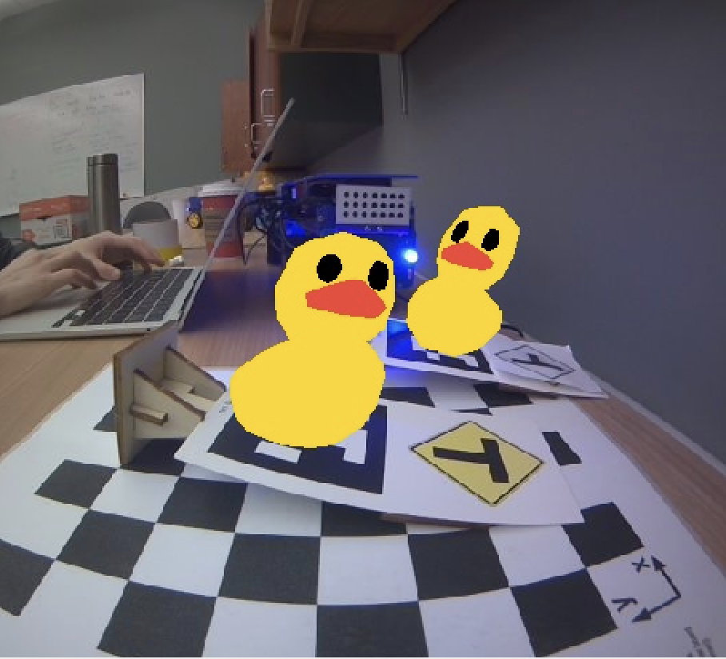

# Exercise 3 - Computer Vision for Robotics



A screenshot of our [Unit A-4 Advanced Augmented Reality Exercise](https://docs.duckietown.org/daffy/duckietown-classical-robotics/out/cra_apriltag_augmented_reality_exercise.html)
results.

## Deliverable 1: April Tag Detection and Labeling

The following video depicts our apriltag detector image topic viewed with `rqt_image_view` demonstrating our apriltag node detecting several apriltags and labeling each with its bounding box and ID number.

<iframe width="100%" height="315" src="https://www.youtube.com/embed/gAck5-vHF6U" title="YouTube video player" frameborder="0" allow="accelerometer; autoplay; clipboard-write; encrypted-media; gyroscope; picture-in-picture; web-share" allowfullscreen></iframe>

### **What does the april tag library return to you for determining its position?**

<!-- TODO -->

### **Which directions do the X, Y, Z values of your detection increase / decrease?**

<!-- TODO -->

### **What frame orientation does the april tag use?**

<!-- TODO: https://docs.google.com/document/d/1bQfkR_tmwctFozEZlZkmojBZHkegscJPJVuw-IEXwI4/edit#heading=h.vzisu8fiu4hj -->

### **Why are detections from far away prone to error?**

Far away apriltags have fewer pixels to detect, so it is more prone to
error and unstable detection as can be seen in the video with apriltag ID 94.

### **Why may you want to limit the rate of detections?**

April tag detection is computationally expensive, so limiting the rate of
detections can reduce Duckiebot CPU usage. Furthermore, if the image does not
change much, it is can unnecessary to recompute April tag detections.

## Challenges

### `.dockerignore`

The `template-ros` repository has a `.dockerignore` and it ignores our
additional files and directories, we have to whitelist them like:

```.dtignore
!maps
```

### cv_bridge

From looking at the [camera driver code](https://github.com/duckietown/dt-duckiebot-interface/blob/daffy/packages/camera_driver/), I learned that we can use []`cv_bridge`](http://wiki.ros.org/cv_bridge/Tutorials/ConvertingBetweenROSImagesAndOpenCVImagesPython)
to convert between OpenCV images and CompressedImage messages.

## image_geometry

The [image_geometry](https://docs.ros.org/en/api/image_geometry/html/python/)
package seems useful for undistorting raw images.

## Docker 23.0.1 breaks dts devel run

After upgrading to Docker 23.0.1, `dts devel run` would error with message:
`docker: Error response from daemon: No command specified.`.

I had to [downgrade](https://docs.docker.com/engine/install/ubuntu/) to Docker 20.10.23 to get it to work again.

```bash
VERSION_STRING=5:20.10.23~3-0~ubuntu-focal
steven@steven-Ubuntu20:~/Github/duckietown/lab3/farfetched$ sudo apt-get install docker-ce=$VERSION_STRING docker-ce-cli=$VERSION_STRING containerd.io docker-buildx-plugin docker-compose-plugin
```

## Sources

* <https://docs.duckietown.org/daffy/duckietown-classical-robotics/out/cra_basic_augmented_reality_exercise.html>
* <http://wiki.ros.org/cv_bridge/Tutorials/ConvertingBetweenROSImagesAndOpenCVImagesPython>
* <https://github.com/duckietown/dt-duckiebot-interface/blob/daffy/packages/camera_driver/>
* <https://docs.ros.org/en/api/image_geometry/html/python/>
* <https://docs.docker.com/engine/install/ubuntu/>
* <https://github.com/duckietown/dt-core/blob/6d8e99a5849737f86cab72b04fd2b449528226be/packages/complete_image_pipeline/include/image_processing/ground_projection_geometry.py#L161>
* <https://bitesofcode.wordpress.com/2018/09/16/augmented-reality-with-python-and-opencv-part-2/>
